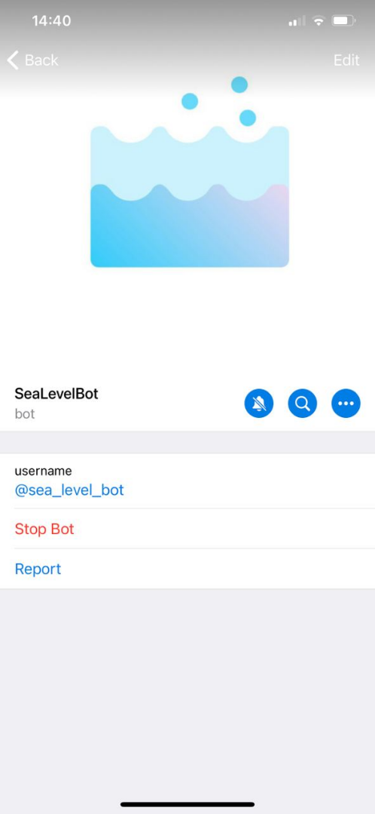

# SeaLevelBot

Telegram bot which is meant to demonstrate sea level change over the years and "predict" it for the future.

## Intensions
The bot is meant for educational and demonstrative cause only. 

## Algorithm
This bot uses  *linear regression*  to calculate the approximate prediction. 

 Linear regression  attempts to model the relationship between 2 variables (year and sea level) by fitting a linear equation to observed data. On the drawn plot you can see the plot of 2 variables itself and 2  *regression lines* : one starts from the year 1880 and second from the 2000. It's done due to the significant difference in annual sea level rise starting from the beginning of the 21st century. 

A  linear regression line  has an equation of the form  *y = b0 + b1 * x* , where  *x*  is the explanatory variable (year) and  *y*  is the dependent variable (sea level). The slope of the line is  *b1*, and  *b0*  is the y-intercept. 

More specifically,  the least squares method  is used. Briefly, it works by finding the minimal total of squares of errors (of distance from the dot to the regression line). 

You can read more on the linear regression  [here](https://en.wikipedia.org/wiki/Linear_regression) . 

## Data
The forecast uses [data](https://datahub.io/core/sea-level-rise) from the US Environmental Protection Agency and the Commonwealth Scientific and Industrial Research Organization, more specifically - data on cumulative changes in ocean levels from 1880 to 2013, based on long-term measurements using tidal meters and satellites. They show the average absolute change in sea level relative to the height of the ocean surface, regardless of whether the land surface nearby decreases or increases.

## Libraries

* *NumP*y library is designed to perform operations with multidimensional arrays and matrices, and also supports a large number of high-level mathematical functions. In this project it is used to set boundaries for the coordinates of the regression lines.
* *Pandas* library is designed for data processing and analysis. It is based on NumPy library, which is a lower level tool. In this project, it is used to analyze information on the annual sea level rise in previous years in order to build regression lines.
* *SciPy* library is designed to perform scientific and engineering calculations. This project uses it's stats module, which is used to calculate the coordinates of the regression line.
* *Matplotlib* library is designed to visualize data using 2D and 3D graphics. In this project it is used to plot on the basis of information on the annual sea level rise in previous years and regression lines.
* *Seaborn* is a higher-level API based on the Matplotlib library. It is used to improve the aesthetic component of the built plots.
* *Aiogram* library is intended for creating telegram bots. 
* *Asyncio* library is designed to simplify the use of asynchronous code, which is the code of the implemented bot.
* *Os* library contains functions for working with the operating system. In this project it is used to delete an image after each time the message is sent to the user.
* *Logging* library is designed to track the flow of program. In this project it is used to track user actions if an error occurs.
* *Urllib* library is intended for network programming and is used in the project exclusively to create a webhook for uploading the bot to the *Heroku* platform.

## Screenshots

## References
Icon of bot is made by [fjstudio](https://www.flaticon.com/authors/fjstudio).